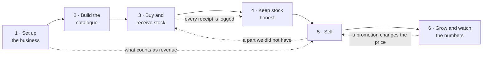

# Fura POS — BPMN

The business process behind the back-office, written to be drawn in Miro.

Read the shape first: **4 horizontal lanes** (who does it) crossed by **6 vertical
columns** (what stage of the business it is). It matches the reference board —
lanes down the left, phase name in a dark bar across the top of each column, and
every column is a small self-contained story with its own green start and red
end.

Nothing here is invented. Every task maps to a screen that exists in the build;
the screen is named in brackets so a reviewer can click through and check.

---

## The frame

### Lanes (rows, top to bottom)

| # | Lane | Who this is | Why it earns a lane |
|---|------|-------------|---------------------|
| 1 | **Owner / Admin** | The person who owns the business or runs it | Makes the decisions that change everyone else's numbers — prices, roles, what counts as revenue |
| 2 | **Stock & Procurement manager** | Buys from suppliers, receives, counts | Owns everything between the supplier and the shelf |
| 3 | **Seller** | Serves the customer at the counter or on the phone | Owns everything between the shelf and the customer |
| 4 | **Fura POS (system)** | The software itself | Does the arithmetic nobody should do by hand: landed cost, reorder quantity, stock balances, revenue |

Four is the cap and four is honest. A "Supplier" would be a fifth, but the
supplier never touches this software — they are drawn as a dashed message
arrow into lane 2, not as a lane.

### Columns (phases, left to right)

| # | Phase | The question it answers |
|---|-------|-------------------------|
| 1 | **Set up the business** | Who are we, and who is allowed to do what? |
| 2 | **Build the catalogue** | What do we sell, and who do we buy it from? |
| 3 | **Buy and receive stock** | How do parts get onto the shelf, and what did they really cost? |
| 4 | **Keep stock honest** | Is the number on screen the number in the rack? |
| 5 | **Sell** | How does a part become money? |
| 6 | **Grow and watch the numbers** | Is this working, and what do we do next? |

Columns 1 and 2 run once at the start. Columns 3–5 are the daily loop.
Column 6 is the monthly loop that feeds back into 3, 4 and 5.

---

## Column 1 — Set up the business

> Runs once, when the company starts using the product. Owner does almost all of it.

| Lane | Type | Node | Screen |
|------|------|------|--------|
| Owner | ● start | New company starts using Fura POS | — |
| Owner | task | Enter company name, address, contacts | Settings → General |
| Owner | task | Enter the US dollar rate | Settings → General |
| Owner | ◆ gateway | **Which sale statuses count as revenue?** | — |
| Owner | task | Tick the statuses that count, and the payment methods a sale may use | Settings → General |
| System | task | Every figure in Dashboard and Analytics is recomputed on those rules | — |
| Owner | task | Add locations — warehouses and shops | Settings → Locations |
| Owner | task | Add brands | Settings → Brands |
| Owner | task | Add categories — a group, and the categories inside it | Settings → Categories |
| Owner | task | Create roles and tick the permission tree | Personnel → Access & roles |
| Owner | task | Add employees, give each a role and a location | Personnel → Employees |
| System | task | Hide from every sidebar what that role may not see | — |
| Owner | task | Choose which events to be told about, and on which channel | Settings → Personal data |
| Owner | ⬤ end | The business is configured | — |

**The gateway matters.** "What counts as revenue" is the one setting that makes
two people quote different revenue figures at each other. Counting an *open*
sale flatters every chart on the dashboard. Draw it as a real decision, not a
checkbox.

---

## Column 2 — Build the catalogue

> Runs once at the start, then trickles on forever as new parts arrive.

| Lane | Type | Node | Screen |
|------|------|------|--------|
| Manager | ● start | We need something to sell | — |
| Manager | task | Add suppliers — terms, currency, lead time | Products → Suppliers |
| Manager | ◆ gateway | **A handful of parts, or a whole price list?** | — |
| Manager | task | *(a handful)* Create the product — make, models, side | Products → Product list → New |
| Manager | task | Add its variations — SKU, barcode, OEM codes, cost, price | Products → Product list |
| Manager | task | *(a whole list)* Upload the supplier's file | Products → Product list → Import |
| System | task | Queue the import and build the variations from it | — |
| System | task | Every variation gets a shelf, a location and a reorder point | — |
| Manager | task | Print shelf and barcode labels | Products → Print templates |
| Manager | ⬤ end | The catalogue is sellable | — |

**Say this out loud on the board:** the thing that is sold is a **variation**,
not a product. A product says *what a part is*; a variation carries the SKU,
the barcode, the cost, the price and the stock. Everything downstream — a sale
line, a stock count, a reorder — points at a variation.

---

## Column 3 — Buy and receive stock

> The first half of the daily loop. Two ways in: the system proposes, or a person decides.

| Lane | Type | Node | Screen |
|------|------|------|--------|
| System | ● start | Stock needs topping up | — |
| System | ◆ gateway | **Did a schedule ask for this, or did a person?** | — |
| System | task | *(schedule)* The schedule reaches its day and time | Procurement → Reorder schedules |
| System | task | Work out what to reorder: how fast it sells × how long the supplier takes, less what is on the shelf and already on order | — |
| System | task | Leave a draft order and notify whoever owns the schedule | — |
| Manager | task | *(a person)* Start an order and pick the supplier | Procurement → Orders → New |
| System | task | Suggest the lines using the same arithmetic | — |
| Manager | task | Change the quantities, drop what is not wanted, confirm | Procurement → Orders |
| System | task | Order becomes **Ordered** — those units now count as *on order* | — |
| Manager | ⇢ message | Send the order to the supplier | *(outside the system)* |
| Manager | task | The lorry arrives — receive it against the order | Products → Goods receipt |
| System | ◆ gateway | **Does what arrived match what was ordered?** | — |
| Manager | task | *(no)* Record the short or over delivery on the receipt | Products → Goods receipt |
| System | task | *(yes)* Add freight, duty and the dollar rate → the real landed cost | — |
| System | task | Raise the stock, close the order lines, move the supplier balance | — |
| Manager | ⬤ end | Parts are on the shelf and their true cost is known | — |

**Why the split is worth drawing:** a scheduled order and a manual order end at
exactly the same place. The difference is only *who noticed*. The schedule
never buys anything on its own — it leaves a draft for a person to approve.
That is the whole point of it, and it is the part clients ask about.

---

## Column 4 — Keep stock honest

> The maintenance loop. Four different things go wrong, and each has its own screen.

| Lane | Type | Node | Screen |
|------|------|------|--------|
| Manager | ● start | The number on screen is doubted, or parts must move | — |
| Manager | ◆ gateway | **What actually happened?** | — |
| Manager | task | *(it moved)* Transfer between locations | Products → Transfers |
| System | task | Take it off one shelf, put it on the other, cost unchanged | — |
| Manager | task | *(damaged, lost, found)* Write a correction with a reason | Products → Corrections |
| System | task | Adjust the stock and keep the reason on the record | — |
| Manager | task | *(miscounted)* Count a location, line by line | Products → Stocktaking |
| System | task | Show the variance — counted against expected | — |
| Owner | task | Approve the count | Products → Stocktaking |
| System | task | Set stock to what was counted | — |
| Owner | task | *(the price is wrong)* Reprice by percentage, supplier or category | Products → Repricing |
| System | task | Apply the new price from its start date | — |
| System | task | Write every one of these to the product log, with a running balance | Analytics → Product logs |
| Manager | ⬤ end | Stock and prices can be trusted | — |

**The last system task is the payoff.** Four different screens all end in one
place: a log where any part can be replayed movement by movement. That is what
makes an argument about stock settleable.

---

## Column 5 — Sell

> The other half of the daily loop, and the only column the Seller lane really lives in.

| Lane | Type | Node | Screen |
|------|------|------|--------|
| Seller | ● start | A customer wants a part | — |
| Seller | task | Open the cash drawer for the day (register, float) | Sales → Cash shifts |
| Seller | task | Find it by SKU, OEM code, barcode or name | Sales → New sale |
| System | ◆ gateway | **Is it in stock at this location?** | — |
| Seller | task | *(no)* Check the other locations, or add it to the next order | → *back to Column 3* |
| Seller | task | *(yes)* Choose the client, or add a new one | Sales → New sale |
| System | task | Show that client's wallet — balance, debt, cashback, credit limit | Marketing → Clients |
| Seller | task | Add the lines: part, quantity, price | Sales → New sale |
| System | task | Apply the best running promotion that matches **the parts and this client** | Marketing → Promotions |
| Seller | task | Choose how it is being paid | Sales → New sale |
| System | ◆ gateway | **Paying cash, with no drawer open here?** | — |
| System | task | *(no drawer)* Refuse the cash sale — open a shift, or take payment another way | Sales → Cash shifts |
| System | ◆ gateway | **On account, and past their credit limit?** | — |
| System | task | *(past it, and limits are enforced)* Stop the sale | — |
| System | task | *(past it, and limits only warn)* Warn, and record the debt anyway | — |
| Seller | task | Save the sale | Sales → New sale |
| System | task | Take the units off the shelf | — |
| Seller | task | Walk it through the lifecycle: new → processed → delivering → delivered → completed | Sales → All sales |
| System | task | Count it as revenue once it reaches a status ticked in Column 1 | — |
| System | task | Attach the cash taken to the open drawer | — |
| Seller | task | At the end of the day, count the drawer and close the shift | Sales → Cash shifts |
| System | task | Compare counted against expected — the **difference** is the number that matters | — |
| Seller | ⬤ end | The sale is done and counted, and the drawer balanced | — |

**The drawer brackets the column.** It opens before the first sale and closes
after the last one, and the two cash nodes in between are the reason it is worth
drawing: a refused cash sale, and a difference at the end.

**Two arrows leave this column.** The "not in stock" branch feeds Column 3 —
that is how demand becomes a purchase order. And the revenue task points back
at Column 1's gateway, which is why that setting deserved a diamond.

> There is no cashier POS anywhere in this diagram. Sales are typed in by hand
> on one screen. If a reviewer looks for a till, that absence is deliberate.

---

## Column 6 — Grow and watch the numbers

> The monthly loop. Owner lane, mostly, and it closes back onto the other columns.

| Lane | Type | Node | Screen |
|------|------|------|--------|
| Owner | ● start | The month is running | — |
| Owner | task | Open the dashboard — one period, every widget | Dashboard |
| System | task | Raise what needs attention: low stock, late orders, money owed | Dashboard |
| Owner | ◆ gateway | **Is it stock, customers, or money that needs looking at?** | — |
| Owner | task | *(stock)* Replay a part's movements to settle a question | Analytics → Product logs |
| Owner | task | *(customers)* Read the segments — champions, at risk, cannot lose | Analytics → Customer report |
| Owner | ◆ gateway | **Is anyone good drifting away?** | — |
| Owner | task | *(yes)* Run a promotion at them — what it covers, and **which clients get it** | Marketing → Promotions |
| System | task | The promotion starts applying itself on the sale screen | → *back to Column 5* |
| Owner | task | *(money)* Build the report — pick a source, group it, measure it, chart it | Analytics → Report generator |
| Owner | task | Save the report so next month is one click | Analytics → Report generator |
| System | task | Send what was subscribed to, on the channel it was asked for | — |
| Owner | ⬤ end | The next month's decisions are made on real numbers | — |

---

## The loops, said plainly

Three arrows make this a system rather than a checklist. Draw them as long
curved connectors under the lanes, labelled:

1. **Column 5 → Column 3** — "a part we did not have" becomes a purchase order.
2. **Column 6 → Column 5** — a promotion made in Analytics changes the price a seller sees.
3. **Column 3 → Column 4** — every receipt lands in the stock log, which is what Column 4 argues with.

---

## Drawing it in Miro

Sizes and colours to match the reference board:

- **Frame**: one wide frame, roughly 4200 × 950. Six columns of ~700, four lanes of ~230.
- **Phase bar**: dark navy (`#0F3557`) strip across the top of every column, white
  bold text, column title centred.
- **Lane labels**: rotated 90° down the left edge. Lane 1 and lane 3 on a light
  grey band (`#EAEAEA`), lanes 2 and 4 white — the alternating stripe makes a
  wide diagram readable.
- **Task**: rounded rectangle, navy fill, white text, ~150 × 55. Keep the text to
  four or five words; the screen name goes in a small grey caption underneath.
- **Gateway**: green diamond outline, no fill, the question written *beside* it
  and each outgoing arrow labelled with its answer.
- **Start event**: small green filled circle. **End event**: small red filled circle.
- **System-to-person handoff**: dashed arrow. **Normal flow**: solid.
- **Supplier**: dashed arrow leaving the right of Column 3 and returning — never a lane.

One rule worth holding: a task belongs to the lane of whoever *does* it, not
whoever benefits. "Work out what to reorder" is a system task even though the
manager asked for it — and that is exactly what makes the automation visible on
the board.

---

## Overview

