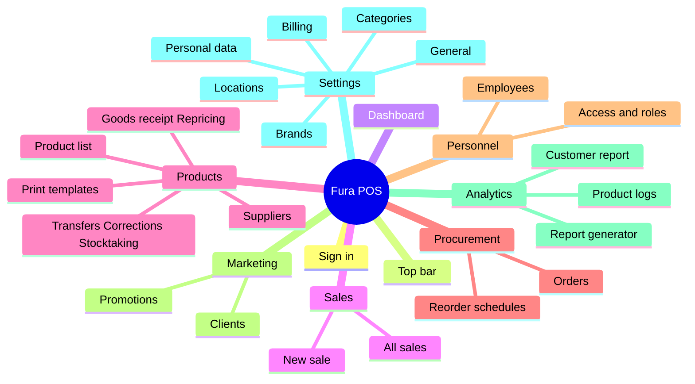

# Fura POS — Mind map

Everything in the product, as one tree. The BPMN in [BPMN.md](BPMN.md) says
*how the work flows*; this says *what exists*. Every screen named in the BPMN
appears here.

One surface: the back-office web app. One panel, eight modules, filtered by
role. Drawn to match the reference board — rounded root on the left, branches
opening rightwards, detail carried in parentheses on the leaf rather than in
another level of nodes.

```
Fura POS  →  Back-office (web)  →  8 modules  →  screens  →  what is on them
```

---

## Sign in
- Sign in (email + password)
- Forgotten password
- The session carries the role — the sidebar is filtered by permission

## Top bar *(on every screen)*
- Sidebar collapse
- Wallet / credit balance
- Theme toggle (light / dark)
- Notifications (dropdown, not a page)
- User menu (profile, sign out)
- *No global search and no create button — both belong to the screen*

---

## 1 · Dashboard
- One period filter driving every widget
- KPI cards (sales, average check, gross margin)
- Charts (revenue over time, top categories, top products)
- Needs attention (low stock, late orders, money owed)
- Drill-down links only — nothing is edited here

## 2 · Sales
- **New sale** (typed by hand — there is no till)
  - Find part (SKU, OEM code, barcode, name)
  - Client (pick or create) → wallet inline (balance, debt, cashback, limit)
  - Lines (part, quantity, price, discount)
  - Promotion applied automatically
  - Payment method
  - Credit-limit check (blocks or warns, per Settings)
- **Cash shifts** (the cash-up, not a till)
  - Open a drawer (register, who is answerable, opening float)
  - Cash in and out by hand (refund, petty expense, collection to the safe)
  - Close it with a counted amount → **difference** against what was expected
  - A cash sale is refused when no drawer is open at that location
- **All sales** (one ledger)
  - Status chips (open, new, processed, delivering, delivered, completed, postponed, deleted)
  - Deleted sales excluded from the list and its totals
  - Sale detail (lines, client, payment, history, print)

## 3 · Products / Services
> The sellable unit is a **variation**, not a product. A product says what a part *is*; a variation carries the SKU, barcode, cost, price, stock and shelf.
- **Product list**
  - By-variation view (default) and by-product view (aggregated)
  - Product card (make, models, side, category, brand, photos)
  - Variations (SKU, barcode, OEM codes, cost, price, stock by location, shelf, reorder point)
  - Bulk import (queued job)
- **Transfers** (location → location, cost unchanged)
- **Corrections** (write-off / write-on, with a reason)
- **Stocktaking** (count a location, variance line by line, approve → stock set to counted)
- **Goods receipt** (received against a purchase order; freight + duty + USD rate → landed cost)
- **Repricing** (by percentage, supplier or category; applies from a date)
- **Print templates**
  - Three kinds (product label, shelf label, receipt), filtered by counted chips
  - Size in mm (presets or typed), barcode / QR / none, ordered fields with one headline
  - Preview drawn at true millimetre size
  - Print a sheet (pick parts, copies each, laid out to fit A4)
- **Suppliers** (terms, currency, lead time, wallet: balance / debt / AI insights)

## 4 · Procurement `New`
- **Orders**
  - New order → pick supplier → lines suggested → adjust → confirm
  - Statuses (draft, ordered, partially received, received)
  - Units on a confirmed order count as *on order*
- **Reorder schedules**
  - When it runs (days of the month, day of the week, time)
  - Which supplier and which location it covers
  - What it proposes (sales rate × lead time, less stock on hand and on order)
  - Leaves a draft order for a person to approve — it never buys anything

## 5 · Personnel management
- **Employees** (name, role, location, phone, wallet, sales this month)
- **Access & roles**
  - Permission tree (module → section → action: view, create, edit, delete)
  - Partial state, not just on / off
  - Ticking an action implies view; unticking view drops the actions

## 6 · Marketing
- **Clients** (contacts, region, purchase history; wallet: balance, debt, cashback, credit limit, AI insights — the list a seller picks from on New sale)
- **Drivers** (who collects parts at the counter)
  - Two sections: **Independent** (owns his truck) and **Autopark** (drives for a company) — a driver who is both appears in each
  - Name, code (what his QR carries), phone, licence, **his own trucks** (several is normal), his autopark and the one truck they assigned him
  - Every truck carries a **plate, make and model** — in a parts business the make is half of "will it fit"
  - Each tab shows only that side's trucks with their make and model; the Autopark column appears only in the autopark tab
  - Scanned on New sale; the purchase then reaches his e-commerce app and his autopark owner's app
- **Promotions**
  - Dates, discount (percent or amount)
  - Applies to — **what**: everything, categories, products
  - Applies to — **who**: everyone, or chosen clients (a walk-in never gets a targeted offer)
  - Categories and products picked from multi-select dropdowns with search
  - Product rows carry image, SKU and OEM codes — parts are named alike

## 7 · Analytics
- **Report generator** (sources: sales, stock, movement, money → pick dimensions and measures, group, chart, save and re-run)
- **Product logs** (every movement of a part, with a running balance)
- **Customer report** (RFM segments: champions, loyal, at risk, cannot lose, lost)

## 8 · Settings
- **General** (company, USD rate, payment methods, which statuses count as revenue, credit-limit rule)
- **Brands** (name, zone, active — cannot delete one still in use)
- **Cash registers** (one per counter; a register with shifts against it is retired, never deleted)
- **Locations** (warehouse / shop, address, area, units and cost held — cannot delete one still holding stock)
- **Categories** (two levels: group → category — cannot delete one with products in it)
- **Billing** (balance, plan, invoices)
- **Personal data**
  - Profile (name, phone, email; role is read-only, changed in Access & roles)
  - Notifications = (event) × (channel) — 10 events × in-app / email / Telegram / SMS, grouped and counted per module

---

## Drawing it in Miro

- **Root**: rounded rectangle, left edge, vertically centred — `Fura POS`.
- **Branches**: elbowed connectors, one accent colour throughout (brand navy
  `#0F3557`), every line the same weight. Several colours read as several
  diagrams.
- **No boxes below the root.** Plain text with a short stub line, exactly as in
  the reference — boxes at every level make a tree this size unreadable.
- **Detail goes in parentheses on the leaf**, never as another level.
  `Locations (warehouse / shop, address, area)` — not four child nodes.
- **Depth cap: four.** Root → module → screen → what is on it. Anything wanting
  a fifth level belongs in parentheses.
- Sign in and Top bar sit at the top of the fan, above Dashboard — they are not
  modules, so give them a little vertical gap.
- Badges: `New` on Procurement. Nothing else carries one.

---

## Overview


